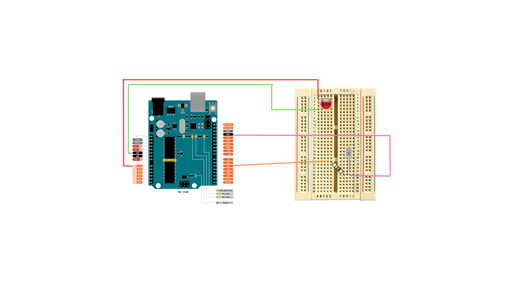

## Projet Yubino – Authenticator embarqué + Client Python

Ce dépôt contient :
- **`authenticator/`** : le firmware AVR jouant le rôle de clé d’authentification (type U2F simplifié) ;
- **`yubino-client/`** : un client Python permettant de piloter l’authenticator (tests unitaires et CLI).

### 1. Firmware `authenticator/`

- Cible : **ATmega328P** (type Arduino Uno).
- Périphériques utilisés :
  - **UART** pour la communication avec le PC (protocole binaire simple) ;
  - **EEPROM** pour stocker les credentials ;
  - **ADC** comme source d’aléa (générateur pseudo‑TRNG) ;
  - **GPIO** pour un **bouton de consentement** et une **LED**.
- Crypto : bibliothèque **micro-ecc** (`micro-ecc/uECC.c`) sur la courbe `secp160r1`.

#### Commandes supportées (côté device)

Les codes sont définis dans `authenticator/consts.h` et correspondent à ceux utilisés par le client Python :

- **`CMD_LIST_CREDENTIALS` (0x00)** : renvoie la liste des credentials stockés ;
- **`CMD_MAKE_CREDENTIAL` (0x01)** : crée une nouvelle paire de clés pour un `app_id` donné ;
- **`CMD_GET_ASSERTION` (0x02)** : signe un challenge pour un `app_id` existant ;
- **`CMD_RESET` (0x03)** : efface tous les credentials de l’EEPROM.

#### Architecture du firmware

- `main.c` :  
  - initialise `uart`, `ui`, `rng` ;  
  - met le CPU en **sleep (SLEEP_MODE_IDLE)** et se réveille sur **interruption UART RX** ;  
  - délègue le traitement à `command_handle(...)` du module de commandes.
- `commands.c` / `commands.h` :  
  - implémentent la logique de haut niveau des commandes (`MAKE_CREDENTIAL`, `GET_ASSERTION`, etc.) ;
  - orchestrent UART, RNG, stockage EEPROM et UI.
- `uart.c` / `uart.h` : initialisation UART (115200 8N1), envoi/réception d’octets/buffers, interruption RX activée.
- `ui.c` / `ui.h` : gestion de la LED et du bouton ; le consentement utilisateur est demandé avant les opérations sensibles, avec **clignotement toutes les 500 ms** et **timeout 10 s** (pour que ce consentement soit donné automatiquement en mode debug, il faut décommenter la ligne 8 de ui.c)
- `rng.c` / `rng.h` : génération d’aléa à partir du bruit de l’ADC.
- `storage.c` / `storage.h` : stockage des credentials en EEPROM (structure `CredentialEntry`, itération, reset, find/save).

#### Choix techniques

**1. Utilisation des timers**

1. **RNG (Timer1)** : accumule du bruit en temps réel via une ISR d'overflow (TIMER1_OVF_vect). Une interruption fréquente et précise est nécessaire pour collecter du bruit utile et injecter de la gigue. Timer1 (16-bit) offre une meilleure résolution que Timer0.
2. **UI (Timer0)** : génère une interruption toutes les 1 ms (mode CTC). Cette fréquence régulière pilote un compteur `ui_ms_counter` utilisé pour gérer le clignotement (toggle toutes les 500 ms) et le timeout (10 s). Un tick de 1 ms offre une précision suffisante pour l'UI sans surcharger le processeur.

**Alternative rejetée : un seul timer pour les deux**

Théoriquement, on pourrait utiliser un seul timer en mode CTC ou PWM pour gérer les deux tâches via une seule ISR multiplexée. Cependant :
- Une fréquence commune (ex. 1 ms) serait soit trop lente pour le RNG (perte d'entropie), soit trop rapide pour l'UI (ISR trop fréquente, consommation énergétique élevée).
- Multiplexer deux tâches indépendantes dans une seule ISR rend le code plus complexe et moins maintenable.
- Garder deux timers distincts permet à chacun d'optimiser sa fréquence et son comportement indépendamment.

**2. Stockage EEPROM avec slot remplacement (pas append-only)**

Dans `storage.c`, le système permet de remplacer une clé existante pour un même `app_id` sans avoir à la supprimer manuellement :
- On recherche d'abord un slot existant (même `SHA1(app_id)`) — s'il existe, on le réutilise.
- Sinon, on trouve le premier slot libre.
- Cette stratégie simplifie le protocole côté client (pas besoin de `RESET` entre deux enregistrements pour le même service).

**Alternative rejetée** : système append-only strict sans remplacement.
- Avantage : garantit que les anciennes clés ne sont jamais écrasées (trace d'audit historique).
- Inconvénient : sur ATmega328P avec 1 KB EEPROM (≈15 credentials max), l'usager serait vite bloqué s'il se réenregistre auprès du même service. Le protocole de test client Python est plus lourd.
- Choix actuel : le remplacement est acceptable car c'est un prototype éducatif et la menace d'overflow est rare.

**3. RNG combiné (ADC + Timer1 avec XOR)**

Dans `rng.c`, la méthode par défaut (`RNG_METHOD_COMBINED`) fusionne deux sources d'aléa :
- **ADC** : lit du bruit sur un canal non connecté ; fréquence ≈ quelques ms.
- **Timer1 (16-bit)** : accumule le TCNT1 sur overflows ; fréquence très rapide (≈65 µs par overflow à 16 MHz).
- **Résultat** : XOR des deux octets pour une meilleure entropie.

**Alternatives rejetées** :
- ADC seul : plus lent et entropie limitée (bruit thermique faible sur un canal flottant).
- Timer seul : rapide mais entropie corrélée (TCNT1 jitter prévisible si pas d'événement externe).
- MD5/SHA1 sur ADC : trop coûteux en cycles CPU pour un ATmega328P; XOR est plus léger et suffisant pour ECDSA sur secp160r1 (protection de 80 bits seulement).

**4. Modèle stateless pour les commandes (pas de session)**

Dans `commands.c`, chaque commande est indépendante :
- Pas de contexte de session qui persiste entre deux commandes.
- Chaque `MakeCredential`, `GetAssertion` etc. alloue ses buffers localement et remet à zéro après.
- Le consentement utilisateur est demandé à chaque opération sensible.

**Avantage** : robustesse et simplicité ; pas de race condition sur un état global de session.

**Alternative rejetée** : machine à états avec contexte de session.
- Serait plus compliquée et consommerait plus de RAM (ATmega328P : 2 KB seulement).
- Avantage : permettrait de pipeliner des commandes ; inconvénient : overkill pour ce protocole simple.

**5. Callback polymorphe pour `storage_iterate()`**

Dans `storage.c` et `commands.c`, la fonction `storage_iterate()` accepte un pointeur de fonction (callback) pour éviter du code dupliqué :
- `ListCredentials` utilise deux passes : comptage puis envoi.
- Plutôt que d'itérer deux fois (boucle en dur), on passe deux callbacks différents.

```c
// Deux usages du même itérateur :
storage_iterate(count_cb, &count);      // compte les entrées
storage_iterate(send_cb, NULL);         // envoie les entrées
```

**Alternative rejetée** : fonction monolithique `storage_list_all()` qui retourne un tableau.
- Inconvénient : consommation RAM accrue (copie de tous les credentials en RAM) ; impraticable sur ATmega328P.
- Choix actuel : callback offre un streaming sans copie et reste peu coûteux en code.

**6. Mode veille `SLEEP_MODE_IDLE` dans `main.c` et `ui.c`**

Le CPU entre en mode idle (pas en power-down) pour réduire la consommation tout en permettant aux ISR de fonctionner :
- Timers, UART RX, ADC ISR continuent de fonctionner.
- Réveil instantané sur interruption.

**Alternative rejetée** : `SLEEP_MODE_PWR_DOWN`.
- Avantage : plus faible consommation.
- Inconvénient : Les timers sont désactivés ; seule une interruption externe (INT0 bouton) réveille le MCU. Avec l'UI qui a besoin de clignoter régulièrement via Timer0, impossible.

#### Schéma matériel / câblage

- **Microcontrôleur** : ATmega328P.
- **LED de consentement** : connectée au **pin D5 (PD5)** via une résistance, puis au GND, configuré en sortie dans `ui.c`.
- **Bouton poussoir** : connecté au **pin A0 (PC0)**, configuré en entrée avec **pull‑up interne** ; le bouton relie A0 au GND lorsqu’il est pressé.

Un schéma du montage (disponible dans le projet si trop petit ici) :



#### Compilation et flash

Depuis le dossier `authenticator/` :

```bash
make          # compile le firmware (yubino.hex)
make flash    # flash sur /dev/ttyACM0 avec avrdude
```


### 2. Client Python `yubino-client/`

Le client Python se trouve dans le dossier `yubino-client/`.  
Il fournit :
- un module `yubino.device` qui encapsule le protocole binaire vers l’authenticator ;
- une **suite de tests unitaires** (`tests/device.py`) qui vérifie le bon comportement du firmware.

#### Installation pour le développement

Depuis `yubino-client/` :

```bash
python3 -m venv .env
source .env/bin/activate
pip install .
```

#### Lancement des tests

Dans `yubino-client/` :

```bash
python -m unittest tests.device -v
```
